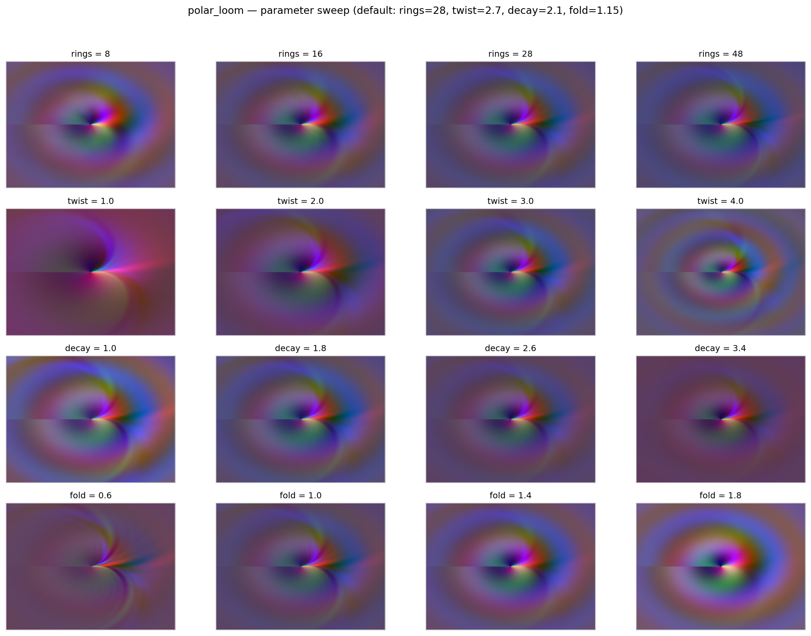
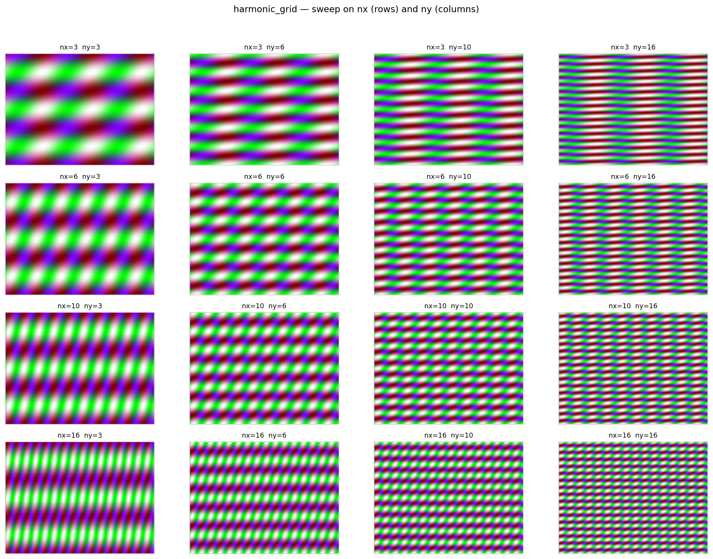
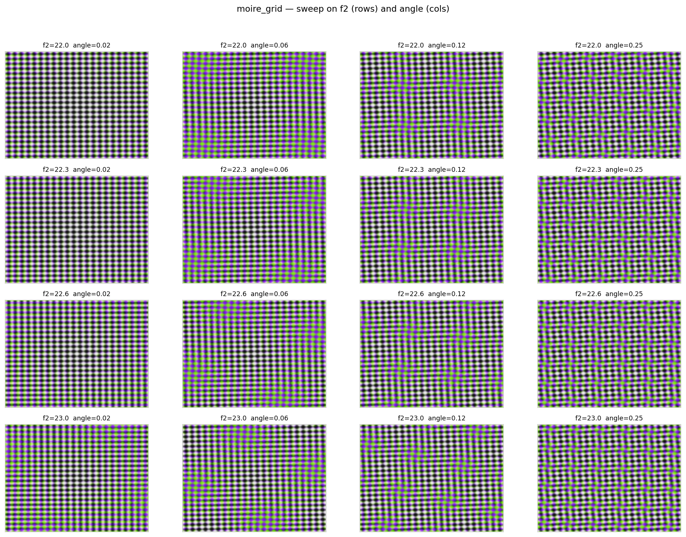

# Deterministic Mathematical Image Generation Pipeline

[](https://github.com/WoodinGlass/math-render-pipeline/actions/workflows/ci.yml)
[](https://math-render-pipeline-3kvjtr8gsh8rtpxsg4fwtc.streamlit.app/)


A production-grade pipeline that renders mathematical formulas into image
artifacts + structured metadata. Every render is byte-deterministic, fully
traceable, and stored with lineage across filesystem/S3, SQLite/Postgres,
and Parquet. Batch and streaming ingestion converge on the same metadata
table.

> Not "math art". A **pipeline** whose payload happens to be math art.

## Live demo

▶️ **[math-render-pipeline-3kvjtr8gsh8rtpxsg4fwtc.streamlit.app](https://math-render-pipeline-3kvjtr8gsh8rtpxsg4fwtc.streamlit.app/)**

Three tabs:

- **Live render** — adjust parameters for any of the three formulas, see output instantly
- **Gallery** — 12 seeded renders across all formulas
- **Metrics** — runtime, cost per megapixel, raw metadata

## What This Is

A data-engineering pipeline for parameterized image generation. Every render is:

- **Deterministic** — same spec ⇒ byte-identical PNG. No RNG, fixed dtype,
  pure NumPy. `formula_hash = SHA-256(formula_id ‖ params ‖ w ‖ h ‖ samples)`.
- **Reproducible** — `checksum = SHA-256(PNG bytes)`. Any drift in output
  bytes is detected automatically.
- **Traceable** — every artifact carries its formula, params, and version.
  Lineage is queryable via SQL and Parquet.
- **Portable** — SQLite or Postgres metadata; filesystem or S3/MinIO
  artifacts. Same code, two backends, chosen by env var.
- **Columnar-friendly** — metadata is small and structured; images are large
  and unstructured. They are stored and queried separately.
- **Streaming-capable** — batch path via CLI/DAG, streaming path via
  Kafka (Redpanda) producer + consumer. Idempotent on `render_id`.
  Failed events go to a DLQ (`render.events.dlq`) with error + attempt
  count; malformed JSON is quarantined without crashing the consumer.
- **Migratable** — Alembic-managed schema, works with SQLite and Postgres.
  `alembic upgrade head` is idempotent and safe on existing DBs.
- **Tested** — pytest suite covering shape, dtype, determinism, checksum,
  parameter sensitivity, metadata idempotency, schema migration, and
  integration tests against real Postgres + Kafka via testcontainers.

## Available Formulas

| ID              | Channels | Params                                | Family                              |
|-----------------|----------|---------------------------------------|-------------------------------------|
| `polar_loom`    | RGB      | `rings, twist, decay, fold`           | Polar harmonics with radial shear   |
| `harmonic_grid` | RGB      | `nx, ny, phase, skew, mix`            | Cartesian orthogonal harmonics      |
| `moire_grid`    | RGB      | `f1, f2, angle, mix, sharpen`         | Interference of two rotated lattices|

**Legend:**
- *RGB* = 8-bit unsigned, shape `(H, W, 3)`
- *Params* = keyword arguments passed to the evaluator
- New formulas register in `src/mrp/evaluators/registry.py`

### Default parameters

| Formula | Defaults |
|---|---|
| `polar_loom` | `rings=28, twist=2.7, decay=2.1, fold=1.15` |
| `harmonic_grid` | `nx=6, ny=4, phase=0.0, skew=0.0, mix=0.5` |
| `moire_grid` | `f1=22.0, f2=22.6, angle=0.06, mix=0.5, sharpen=1.4` |

Run `mrp formulas` for the live registry.

## Quick Start

### Single render

```bash
pip install -e .
mrp run --formula polar_loom --width 1600 --height 1200 \
  --params '{"rings":28,"twist":2.7,"decay":2.1,"fold":1.15}'
```

Output:

```json
{
  "render_id": "4b719e1c4b32f914-086e1a27",
  "formula_id": "polar_loom",
  "formula_hash": "4b719e1c4b32f91400fddb163b6b24c6830742630e2f74a9f77d1049ae1b8d87",
  "params_json": {"rings": 28, "twist": 2.7, "decay": 2.1, "fold": 1.15},
  "width": 1600, "height": 1200,
  "runtime_ms": 10702,
  "checksum": "c73c1002d72460e321e6688ea9ae40bc104e4f082b1aeb33960e4c5a21503c43",
  "storage_uri": "file:///.../full.png",
  "preview_uri": "file:///.../preview.png",
  "bytes_full": 408395,
  "bytes_preview": 84190
}
```

### Batch render

```bash
mrp batch --csv params/example_params.csv
```

CSV columns: `formula_id, width, height, params_json`.

### Inspect the registry

```bash
mrp formulas
```

## Streaming

Two ingestion paths converge on the same `render_events` table:

| Path    | Command                            | Backend                    |
|---------|------------------------------------|----------------------------|
| Batch   | `mrp run` / `mrp batch` / Airflow  | direct insert              |
| Stream  | `mrp produce` → Kafka → consumer   | Redpanda + consumer group  |

```bash
# Start the streaming stack
docker compose up -d redpanda postgres consumer

# Publish 5 renders to render.events
mrp produce --csv params/example_params.csv

# Consumer runs continuously; safe against re-delivery
mrp consume --max-messages 5

# Or one-shot: render + publish
mrp run --formula polar_loom --width 800 --height 600 \
  --params '{"rings":20,"twist":2.0,"decay":2.0,"fold":1.0}' --stream
```

The consumer is idempotent on `render_id` — safe against Kafka re-delivery.
The `ingest_source` column ('batch' or 'stream') distinguishes the two paths.

### Reliability contract

| Failure mode | Behaviour |
|---|---|
| Transient DB error | Retry with exponential backoff (default 3 attempts) |
| Permanent DB error after retries | Publish to `render.events.dlq`, commit offset, continue |
| Malformed JSON / missing fields | Quarantine to DLQ, commit offset, continue |
| Consumer crash mid-batch | Uncommitted offsets replayed; `insert_event` dedups |

Each DLQ payload contains `correlation_id`, `original_topic`, `error`,
`attempts`, `raw`, `failed_at`. The consumer emits one `correlation_id`
per event across all log lines for tracing.

## Metadata Schema

Table `render_events` (SQLite or Postgres):

| Column          | Type        | Meaning                                  |
|-----------------|-------------|------------------------------------------|
| `render_id`     | TEXT PK     | `formula_hash[:16]` + short uuid         |
| `formula_id`    | TEXT        | e.g. `polar_loom`                        |
| `formula_hash`  | TEXT        | SHA-256 of spec                          |
| `params_json`   | JSON/TEXT   | Formula parameters                       |
| `width`, `height` | INT       | Output dimensions                        |
| `runtime_ms`    | INT         | Wall-clock render time                   |
| `checksum`      | TEXT        | SHA-256 of PNG bytes                     |
| `storage_uri`   | TEXT        | `file://` or `s3://` to full render      |
| `preview_uri`   | TEXT        | `file://` or `s3://` to 512px preview    |
| `bytes_full`    | BIGINT      | Size of full PNG                         |
| `bytes_preview` | BIGINT      | Size of preview PNG                      |
| `ingest_source` | TEXT        | `'batch'` or `'stream'`                  |
| `created_at`    | TIMESTAMPTZ | Insert time                              |

Parquet mirror is partitioned by `formula_hash[:16]` and written with ZSTD.

## Schema migrations

```bash
alembic upgrade head      # apply all migrations
alembic current           # show current revision
alembic stamp head        # mark existing DB as current (no-op migration)
```

DSN is read from `$POSTGRES_DSN` (SQLite or Postgres). Migrations are
idempotent: `CREATE TABLE / INDEX IF NOT EXISTS` so the initial revision
applies cleanly on databases created by the pre-Alembic code path.

Migration files live in `migrations/versions/`. To add one:

```bash
alembic revision -m "add column X"
# edit the generated file
alembic upgrade head
```

## Determinism Contract

| Artifact       | How                                                          |
|----------------|--------------------------------------------------------------|
| PNG bytes      | NumPy → Pillow, no RNG, fixed dtype, stable compressor       |
| `formula_hash` | SHA-256 of `(formula_id, params, width, height, samples)`    |
| `checksum`     | SHA-256 of the PNG payload                                   |
| `render_id`    | `formula_hash[:16]` + `uuid4()[:8]` (collision-free inserts) |
| Stream event   | Kafka key = `render_id`; consumer idempotent on same field   |

Implication: the same spec always produces the same bytes; different runs
produce distinct `render_id`s so every render is preserved as an event.

## Architecture

```
params.csv ──▶ Renderer (NumPy) ──▶ PNG full + preview ──▶ filesystem / S3
                     │
                     ├──▶ SQLite / Postgres: render_events
                     ├──▶ Parquet: partitioned by formula_hash[:16]
                     └──▶ Kafka topic: render.events
                                │
                                ▼
                        Consumer (group: mrp-consumer)
                                │
                                ├──▶ Postgres: render_events (idempotent)
                                └──▶ render.events.dlq (poison / failure)
```

Layers:

- **Evaluator** — pure NumPy. No IO. Deterministic by construction.
- **Renderer** — wraps evaluator, produces bytes, computes checksum.
- **Storage** — filesystem or S3/MinIO, selected by `USE_S3`.
- **Metadata** — SQLite or Postgres, selected by `POSTGRES_DSN` scheme.
- **Migrations** — Alembic (`migrations/`), SQLite + Postgres dialects.
- **Producer** — Kafka publisher (`src/mrp/streaming/producer.py`).
- **Consumer** — idempotent stream ingester with DLQ
  (`src/mrp/streaming/consumer.py`).
- **CLI** — `mrp run`, `mrp batch`, `mrp produce`, `mrp consume`, `mrp formulas`.
- **DAG** — Airflow (`dags/render_pipeline_dag.py`).
- **Transforms** — dbt models (`dbt/models/`).
- **DQ runtime** — `data_quality/run_checks.py` (hand-rolled) +
  `data_quality/run_ge.py` (GE-style suite).
- **Dashboards** — Grafana provisioning + `mrp.json`.
- **Demo** — Streamlit app (`app.py`).

See [`docs/architecture.md`](docs/architecture.md) for the full diagram.

## Installation

```bash
python -m venv .venv && source .venv/bin/activate
pip install -e ".[dev]"

# Optional extras
pip install -e ".[dev,streaming]"      # Kafka producer + consumer
pip install -e ".[dev,migrations]"     # Alembic + SQLAlchemy + psycopg
pip install -e ".[dev,dq]"             # Great Expectations
pip install -e ".[dev,integration]"    # testcontainers (Docker)

cp .env.example .env
# edit .env if you want Postgres, S3, or Kafka
```

Minimal (no Postgres, no S3, no Kafka):

```
POSTGRES_DSN=sqlite:///./data/mrp.sqlite
USE_S3=false
```

Full stack (Docker Compose):

```bash
docker compose up -d            # Postgres + Redpanda + MinIO + Grafana
docker compose up -d consumer   # streaming consumer
```

## Data quality

Two independent runtimes:

| Tool | Style | Use case |
|---|---|---|
| `data_quality/run_checks.py` | hand-rolled checks | fast local + CI |
| `data_quality/run_ge.py`     | GE-style suite from JSON | contract-style, shareable |

```bash
python data_quality/run_checks.py                       # soft (default)
python data_quality/run_checks.py --strict-integrity    # hard-fail on DB/Parquet divergence
python data_quality/run_checks.py --max-age-hours 6 --min-today 3
python data_quality/run_ge.py                           # GE suite
```

Four tiers in `run_checks.py`:

| Tier | Checks |
|---|---|
| **schema** | non-null `render_id`, SHA-256 format, dimensions range, preview ≤ full |
| **freshness** | newest render ≤ `--max-age-hours` old |
| **volume** | at least `--min-today` renders today |
| **integrity** | DB `render_id` set == Parquet `render_id` set (soft by default) |

DB is the source of truth; Parquet is an analytics mirror with eventual
consistency. Integrity divergence is a warning unless `--strict-integrity`.

`run_ge.py` loads rows into a pandas DataFrame and applies every
expectation in `great_expectations/expectations/renders_suite.json`.
It exits 0 on pass, 1 on failure. Wired into the Airflow DAG as the
`great_expectations` task between `data_quality` and `dbt_run`.

## Testing

```bash
pytest -q                    # unit tests only (integration deselected)
pytest -q -m integration     # requires Docker
```

Coverage:

- `test_evaluators.py`, `test_harmonic_grid.py`, `test_moire_grid.py` — output
  shape/dtype, determinism, parameter sensitivity, non-blank check.
- `test_properties.py` — Hypothesis invariants for all three formulas:
  determinism across *any* valid parameter set, non-degenerate output.
- `test_renderer.py` — hash stability, checksum format, preview < full.
- `test_registry.py` — plural registry, defaults present, unknown raises.
- `test_metadata.py` — insert + query round-trip, Parquet output.
- `test_streaming_schemas.py` — event round-trip through Pydantic.
- `test_streaming_metadata.py` — idempotent insert, migration adds column.
- `test_consumer_dlq.py` — DLQ routing, retry semantics, poison-pill guard
  (no Kafka required; uses monkeypatched producer).

Integration tests (`tests/integration/`, marked `integration`):

- `test_postgres_roundtrip.py` — real Postgres via testcontainers;
  `insert()` and `insert_event()` round-trip + dedup.
- `test_kafka_pipeline.py` — Redpanda container; producer → consumer →
  metadata, end-to-end.

They skip gracefully when Docker is unavailable, and run in CI as a
dedicated job.

## CI

GitHub Actions runs two jobs on every push and PR:

**test**
1. `pip install -e ".[dev,streaming,migrations,dq]"`
2. `ruff check src tests`
3. `alembic upgrade head` (fresh SQLite) + `alembic current`
4. `pytest -q` (unit)
5. Smoke render at 320×240

**integration** (needs test)
1. `pip install -e ".[dev,streaming,integration]"`
2. `pytest -q -m integration tests/integration -v`
   — spins up Postgres 16 and Redpanda via testcontainers.

## Visual Output

Every formula ships with a default preview and a parameter sweep. All
panels are byte-reproducible from the parameters shown — same code, same
seed-free deterministic output.

### `polar_loom`

**Default** — `rings=28, twist=2.7, decay=2.1, fold=1.15`, 1600×1200.


Polar-harmonic interference with radial shearing.

**Sweep** — rows: `rings` (8 → 48), columns: `twist` (1.0 → 4.0).



### `harmonic_grid`

**Default** — `nx=6, ny=4, phase=0.0, skew=0.0, mix=0.5`, 1600×1200.


Cartesian orthogonal harmonics.

**Sweep** — rows: `nx` (3 → 16), columns: `ny` (3 → 16).



### `moire_grid`

**Default** — `f1=22.0, f2=22.6, angle=0.06, mix=0.5, sharpen=1.4`, 1600×1200.


Interference between two rotated lattices.

**Sweep** — rows: `f2` (22.0 → 23.0), columns: `angle` (0.02 → 0.25 rad).



Beat fringe width grows as the two frequencies converge and the rotation
angle decreases.

## Trade-offs

See [`docs/blog/reproducible-math-art.md`](docs/blog/reproducible-math-art.md)
for a longer discussion. Summary:

- **Determinism** buys idempotency, auditability, cheap diffs.
- **Cost:** `O(pixels × rings × 3)` per image. Does not scale like
  neural rendering; scales like a scientific compute job.
- **Right tool when:** reproducibility is a hard requirement, sweeps
  matter, artifacts must be diffable.
- **Wrong tool when:** photorealism or interactive latency is required.
- **DLQ over retry-forever:** failed events don't block the consumer.
  Offset is committed after DLQ publish, so the stream moves forward while
  the failure is preserved for replay.

## Roadmap

### Done
- [x] Three formulas (`polar_loom`, `harmonic_grid`, `moire_grid`)
- [x] Batch + streaming ingestion (Kafka/Redpanda producer + consumer)
- [x] Streaming reliability: retry w/ backoff, DLQ, poison-pill guard,
      correlation_id in every log line
- [x] Data-quality runtime: schema + freshness + volume + integrity
      (soft by default, `--strict-integrity` for hard fail)
- [x] Property-based tests (Hypothesis) for all three formulas
- [x] Schema migration framework (Alembic) — SQLite + Postgres dialects
- [x] Integration tests with testcontainers (real Kafka + Postgres)
- [x] Great Expectations runtime wired into the DAG
- [x] Airflow DAG (`dags/render_pipeline_dag.py`)
- [x] dbt models: `stg_renders → dim_formula / fct_render_events / agg_cost_daily`
- [x] Grafana dashboard: CPU-minutes/day, renders/day, storage MB, events/min
- [x] Docker Compose stack (Postgres + Redpanda + MinIO + Grafana)
- [x] Terraform skeleton: S3 lifecycle tiering + RDS Postgres
- [x] Live demo on Streamlit Cloud

### Next — observability
- [ ] Prometheus `/metrics` endpoint
- [ ] OpenTelemetry tracing (producer → consumer → DB)
- [ ] Structured JSON logs with correlation_id
- [ ] Grafana Alertmanager rules (freshness, volume, DLQ rate)
- [ ] Runbooks for common incidents (`docs/runbooks/`)

### Next — cost & benchmark
- [ ] Benchmark: batch vs streaming throughput
- [ ] Cost model: $ per 1000 renders
- [ ] Scale test: 10k renders, find the bottleneck
- [ ] Backfill test: 30 days × 5 specs

### Stretch
- [ ] Fourth formula (`lissajous_web` / `harmonograph`)
- [ ] Multi-cloud IaC (AWS + GCP)
- [ ] OpenLineage + Marquez for lineage
- [ ] Spot instances (AWS Batch) for renderer

## License

MIT — see [LICENSE](LICENSE).
