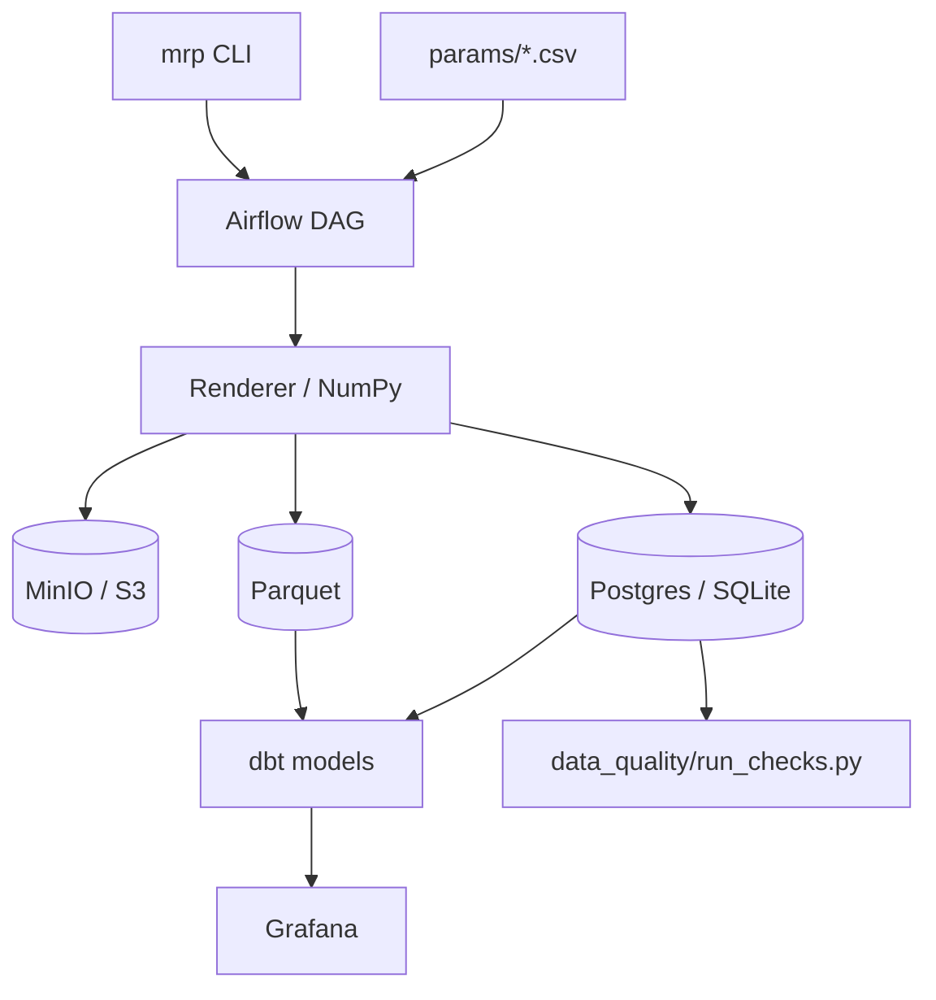

# Architecture

## Layers

| Layer | Code | Backend | Selector |
|---|---|---|---|
| Evaluator | `src/mrp/evaluators/` | pure NumPy | `formula_id` |
| Renderer | `src/mrp/renderer.py` | n/a | — |
| Storage | `src/mrp/storage.py` | filesystem / S3 | `USE_S3` |
| Metadata | `src/mrp/metadata.py` | SQLite / Postgres | `POSTGRES_DSN` |
| CLI | `src/mrp/cli.py` | Typer | `mrp ...` |
| DAG | `dags/` | Airflow 2.9 | `@daily` |
| Transforms | `dbt/models/` | dbt-postgres | `dbt run` |
| DQ | `data_quality/run_checks.py` | stdlib | CLI |
| Dashboards | `grafana/` | Grafana 11 | provisioning |

## Determinism contract

1. `formula_hash = sha256(formula_id ‖ params ‖ width ‖ height ‖ samples)`
2. `checksum     = sha256(PNG bytes)`
3. Same spec ⇒ same `formula_hash` ⇒ byte-identical PNG.
4. `render_id` adds `uuid4` suffix so runs are distinct events.
